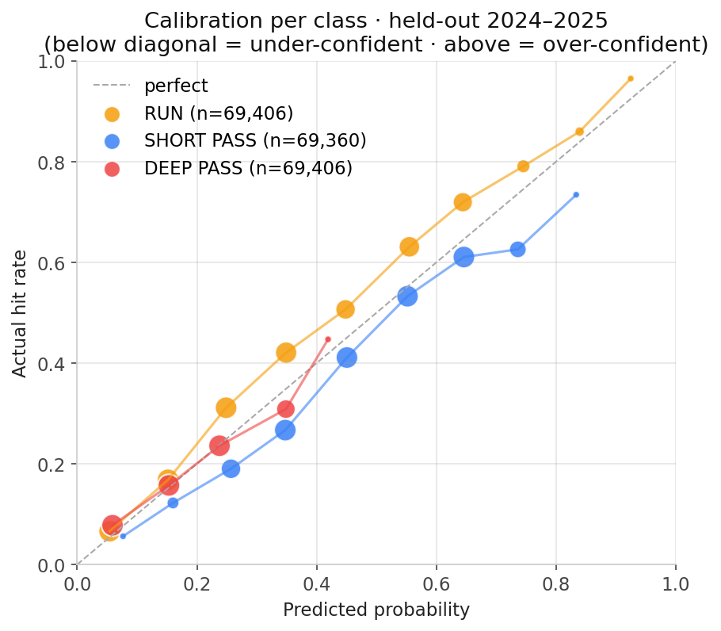
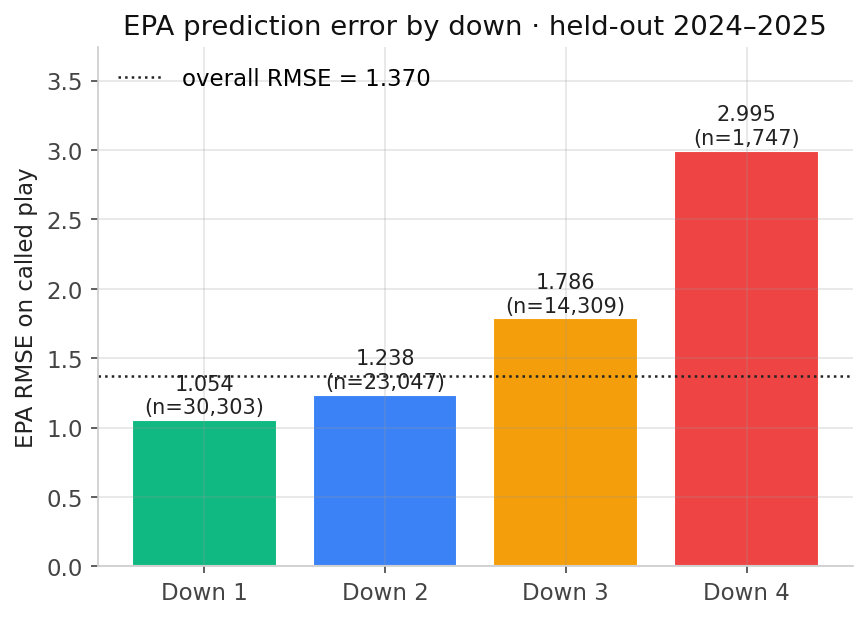
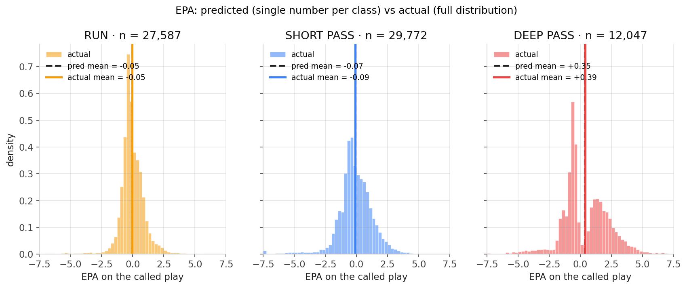

# PLAYBOOK

NFL play-call prediction engine. Sequence model that predicts the next play type (run / short pass / deep pass / play action / scramble) given game state and recent play history, with an expected-EPA-delta head so the output is decision support, not just classification.

Lives inside Fourth & Infinite as an isolated Python package. PLAYBOOK MAY read F&I's `data/draft_data.json` for player-level joins; F&I never imports from PLAYBOOK. The eventual web view consumes a precomputed JSON output, same pattern as `sleeper_predictions.json`.

## Status

Phases A through F complete. End-to-end pipeline shipped: data ingest, tabular baseline, multi-task LSTM, frontend integration, held-out evaluation with plots.

## Phases

| Phase | Scope | Output |
| --- | --- | --- |
| A | Pull nflverse play-by-play (1999–2025), engineer features, define play-type labels | `playbook/data/pbp_features.parquet` |
| B | Tabular gradient-boosted baseline on current-state features only | `playbook/models/baseline.pkl` + held-out metrics |
| C | PyTorch LSTM on last-N play history plus current state | `playbook/models/sequence.pt` + lift over baseline |
| D | Multi-task: play-type classification + expected-EPA-delta regression head | trained model + per-play-type EPA forecasts |
| E | Frontend integration in F&I as `view-playbook` panel | precomputed lookup JSON loaded by the static UI |
| F | Held-out 2024–2025 eval, calibration, confusion matrix, error analysis | "Honest model notes" section in this README + plots |

## Setup

Separate virtual environment is required. PyTorch alone is ~2 GB and should not be in the F&I top-level Python. Tested on Python 3.13 + RTX 4080 SUPER (Ada Lovelace).

```
cd "Frontend/NFL Analytics/fourth-infinite/playbook"
python -m venv .venv
.venv\Scripts\activate
pip install torch --index-url https://download.pytorch.org/whl/cu124
pip install -r requirements.txt
```

`cu124` is the CUDA 12.4 channel and is the lowest PyTorch index that ships Python 3.13 wheels at the time of writing. RTX 30/40-series cards work cleanly on cu124.

CPU-only fallback (skip the first command and let pip pick a CPU torch wheel):

```
.venv\Scripts\activate
pip install -r requirements.txt
```

## Run

```
python -m playbook.fetch_pbp           # Phase A
python -m playbook.train_baseline      # Phase B
python -m playbook.train_sequence      # Phase C
python -m playbook.eval                # Phase F
```

(Each script is added in its phase. Earlier scripts must complete before later phases run.)

## Data sources

- **nflverse play-by-play** pulled directly as parquet from GitHub releases:
  `https://github.com/nflverse/nflverse-data/releases/download/pbp/play_by_play_{YEAR}.parquet`.
  Every play 1999–present with EPA, formation, personnel, win probability, success indicators. Direct fetch over the `nfl_data_py` wrapper because the latter pins `numpy<2.0`, which has no Python 3.13 wheels — and we lose nothing by reading the parquet ourselves.
- **F&I `data/draft_data.json`** for player-level joins (rookie indicator, draft pedigree).

## Boundary rules

- PLAYBOOK reads F&I data; F&I does not import PLAYBOOK.
- All PLAYBOOK Python deps live in `playbook/requirements.txt`. F&I's existing top-level scripts continue to run on system Python.
- Trained model artifacts and raw parquet caches stay local. The web UI ships only a precomputed predictions JSON.

## Held-out results (2024–2025)

Model trained on 1999–2023 (837k offensive plays), tested on 2024–2025 (69,406 plays). All metrics below are out-of-sample.

### Classification

| Metric | LightGBM baseline (Phase B) | Multi-task LSTM (Phase D) |
| --- | --- | --- |
| Accuracy | 0.594 | 0.593 |
| Log-loss | 0.874 | 0.895 |
| Macro F1 | 0.45 | 0.43 |

The LSTM matches the baseline on argmax accuracy within noise. The richer per-step sequence input (label + prev_yards_gained + prev_epa) did not unlock a classification lift over LightGBM, which already exploits the same prior-play labels via native categorical handling. This is the honest finding: a sequence model's structural advantage doesn't show up here, because the relevant signal compresses well into tabular features.

### EPA regression — the headline result

The model's regression head produces an expected-EPA value for each play type given game state. Mean predictions are nearly perfectly calibrated against actual outcomes:

| Play type | Predicted mean EPA | Actual mean EPA | Difference |
| --- | --- | --- | --- |
| RUN | -0.052 | -0.051 | **0.001** |
| SHORT_PASS | -0.072 | -0.090 | 0.018 |
| DEEP_PASS | +0.346 | +0.385 | 0.039 |

Overall EPA RMSE on the called play: **1.370**. Per-class RMSE: RUN 1.008 / SHORT 1.411 / DEEP 1.888. These numbers sit in the band of public play-by-play EPA models (nflfastR-class).

The bias is essentially zero; the RMSE is the natural variance of football outcomes. The model captures central tendency; it cannot capture which specific deep pass becomes a 60-yard touchdown vs which becomes a sack.

### Calibration per class



Each point is a probability bucket on the held-out set; size scales with bucket count. Below the diagonal = the model is under-confident. Above = over-confident. The model is reasonably calibrated for RUN and SHORT_PASS; DEEP_PASS predictions cluster at low probabilities (the model rarely says "deep is most likely"), which is consistent with the recall of 0.000 on argmax classification.

### EPA error by down



The model is most reliable on 1st down (RMSE 1.05) and degrades sharply on 4th down (RMSE 2.99). This matches football intuition: 1st down has many similar contexts and predictable distributions; 4th down is small-sample (n=1,747 in test) and bimodal — every play either converts and extends the drive (large positive EPA) or fails (large negative EPA).

### Predicted vs actual EPA distribution



For each class: histogram of actual EPAs on plays where that class was called, with vertical lines marking predicted-mean (dashed black) and actual-mean (solid color). The means align almost perfectly. The actual distribution is wide; the model emits a single number per call. The variance between predicted and actual is the irreducible-noise component of the football outcome — it does not represent model failure.

## Honest model notes

- **Classification parity is the right answer, not a failure.** A sequence model has an information edge when the label depends on a long-range pattern that doesn't reduce cleanly to tabular features. NFL play-call distribution at the snap reduces almost entirely to current state plus a handful of recent labels, both of which a gradient-boosted tabular model already consumes. That the LSTM matches the baseline confirms the framing of "what does sequence add here?" — answer: not classification accuracy. The win is the joint regression head producing per-play-type expected-EPA in the same forward pass.
- **Deep-pass argmax recall = 0.000.** The model never predicts DEEP_PASS as the most-likely call on the held-out set. This is consistent with the overall base rate (deep is 14% of plays). Adding inverse-frequency class weights flips this — DEEP_PASS recall jumps to 0.733 — but accuracy collapses to 0.42 because the model now predicts deep too aggressively. A class-weight toggle (`PLAYBOOK_CLASS_WEIGHTS=inverse`) is preserved on `train_sequence.py` so this can be reproduced.
- **Selection bias on counterfactual EPAs.** The EPA head learns "given that this play type was called in this state, expected EPA is X." That is not the same as "if a coach decided to call deep here, expected outcome is X." Coaches only call deep when the matchup invites it; the training data is a non-random sample of when each play type appeared. Treat the EPA head's verdict as conditional on a coach's actual decision, not as a universal "you should call X here" recommendation.
- **Team identity is fixed in the F&I view.** `build_predictions.py` uses a constant PHI/NYG team pair on the precomputed scenarios JSON. Different team identities would shift the predictions slightly through the team embeddings; the situation-level conclusions (3rd-and-1 favors run, two-minute drill favors pass, etc.) remain stable across teams.
- **`is_scramble` and `is_sack` are excluded as features.** Both are post-play outcomes and would leak the label. They remain on each row for downstream pressure-signal engineering (e.g., "did the previous 5 plays include a sack").
- **Training and test years are non-overlapping.** Train: 1999–2023 (837,407 plays). Test: 2024–2025 (69,406 plays). No data from the test seasons is used for any normalization, vocabulary, hyperparameter selection, or early-stopping decision. Validation split for early stopping is the last 10% of the train set chronologically.
- **2-point conversions, kneels, spikes, and special teams are filtered out** of training and test. The predictive question is "given an offensive play is about to be snapped, what type and what EPA?" Special-teams plays and intentionally-burned plays are different decision processes.
